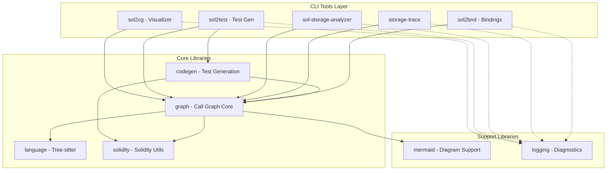

# Traverse: Architecture and Design

## 1. Introduction and Core Philosophy

### 1.1 Project Vision

Traverse is a comprehensive suite of static analysis tools for Solidity smart contracts. Its core philosophy centers on a fundamental insight: all meaningful interactions in a smart contract system can be represented as a Call Graph. By building a single, highly accurate Call Graph representation of a codebase, Traverse creates a unified data model that powers multiple specialized analysis tools.

This approach ensures consistency across tools, reduces redundancy, and allows each tool to benefit from improvements to the core graph extraction engine. Whether generating visualizations, creating test suites, or analyzing storage patterns, all Traverse tools operate on the same foundational Call Graph structure.

### 1.2 High-Level Architectural Diagram



### 1.3 Glossary of Terms

- **AST (Abstract Syntax Tree)**: A tree representation of the syntactic structure of source code, produced by the parser
- **Call Graph**: A directed graph where nodes represent functions/contracts and edges represent relationships like calls, storage access, or control flow
- **Node**: A vertex in the Call Graph representing a code element (function, modifier, state variable, etc.)
- **Edge**: A directed connection between nodes representing a relationship (call, return, storage read/write)
- **Span**: Source code location information (start and end positions) for AST nodes
- **Entry Point**: A public or external function that can be called from outside the contract
- **Pipeline Step**: A modular analysis phase that processes the AST to build or enrich the Call Graph

---

## 2. The Data Processing Pipeline: From Source Code to Call Graph

The Traverse architecture follows a clear data flow pipeline that transforms Solidity source code into actionable insights.

### 2.1 The Flow

```mermaid
graph LR
    source[Solidity Source Files]
    manifest[Manifest Discovery]
    parser[Tree-sitter Parser]
    ast[Abstract Syntax Tree]
    pipeline[Core Pipeline]
    base_graph[Base Call Graph]
    analyzers[Specialized Analyzers]
    enriched[Enriched Call Graph]
    generators[Output Generators]
    outputs[Visualizations/Tests/Reports]
    
    source --> manifest
    manifest --> parser
    parser --> ast
    ast --> pipeline
    pipeline --> base_graph
    base_graph --> analyzers
    analyzers --> enriched
    enriched --> generators
    generators --> outputs
```



### 2.2 Stage 1: Parsing

The parsing stage transforms raw Solidity source code into a structured AST.

#### Components:
- **`crates/language`**: Provides Tree-sitter grammar bindings for Solidity. This crate encapsulates the low-level parsing infrastructure.
- **`crates/graph/src/parser.rs`**: High-level parsing utilities that consume Tree-sitter output to build a strongly-typed, project-specific AST.
- **`crates/graph/src/manifest.rs`**: Discovers and manages Solidity files across a project, handling directory traversal and file filtering.

Tree-sitter's **incremental parsing** and **error recovery** capabilities provide resilience to both syntax errors and Solidity language version differences. The parser can process code written in different Solidity versions (0.4.x through 0.8.x) within the same analysis session, creating error recovery nodes for unrecognized syntax while continuing to parse the remainder of the tree successfully. This allows Traverse to analyze mixed-version codebases and partially malformed contracts rather than failing completely.

### 2.3 Stage 2: Core Graph Construction

The heart of Traverse is the `CallGraphGeneratorPipeline` (defined in `cg.rs`), which orchestrates a sequence of analysis steps to build the Call Graph.

#### Pipeline Architecture:
- **Modularity**: Each step implements the `CallGraphGeneratorStep` trait
- **Configurability**: Steps can be enabled, disabled, or configured independently
- **Shared Context**: Steps communicate through a shared `CallGraphGeneratorContext`

#### Essential Pipeline Steps:

1. **`ContractHandling` (`steps/entity.rs`)**:
   - Scans the AST for structural elements
   - Creates nodes for contracts, interfaces, libraries
   - Identifies functions, constructors, modifiers, and state variables
   - Builds inheritance relationships
   - Populates the initial node structure of the graph

2. **`CallsHandling` (`steps/channel.rs`)**:
   - Analyzes function bodies for interactions
   - Identifies direct function calls, library calls, and contract creations
   - Detects storage variable access (reads and writes)
   - Recognizes event emissions and require statements
   - Creates edges between nodes based on these interactions
   - Leverages Expression Analysis for complex call resolution

#### Supporting Components:
- **`interface_resolver.rs` (BindingRegistry)**: Maps interfaces to their implementations, crucial for accurate call target resolution
- **`builtin.rs`**: Provides definitions for standard Solidity functions and types (msg.sender, block.timestamp, etc.)

### 2.4 Stage 3: Specialized Graph Analyzers

These modules consume the base Call Graph and add specialized analysis layers:

#### Expression Analysis (`chains.rs`)
Critical for resolving complex, chained calls like `getFactory().createPair(tokenA, tokenB).initialize()`:
- Recursively breaks down nested expressions
- Tracks types through method chains
- Resolves intermediate return values
- Determines final call targets

#### Storage Access Analysis (`storage_access.rs`)
Tracks state variable interactions:
- Identifies which functions read from specific storage variables
- Tracks storage writes and their locations
- Adds `StorageRead` and `StorageWrite` edges to the graph
- Aggregates storage access patterns for summary generation

#### Reachability Analysis (`reachability.rs`)
Determines code accessibility:
- Identifies all public/external functions as entry points
- Uses graph traversal algorithms (DFS/BFS) to trace reachable code
- Detects dead code (unreachable functions)
- Provides traversal utilities for other analyzers

---

## 3. The Call Graph Data Structure

The Call Graph is the central unifying data structure that all Traverse tools operate on. Defined in `crates/graph/src/cg.rs`, it provides a comprehensive representation of all code interactions.

### 3.1 Node Types

```rust
pub enum NodeType {
    Function,         // Regular functions
    Interface,        // Interface definitions
    Constructor,      // Contract constructors
    Modifier,         // Function modifiers
    Library,          // Library functions
    StorageVariable,  // State variables
    Evm,             // Synthetic node for EVM interactions
    EventListener,   // Synthetic node for event listeners
    RequireCondition,// Require/assert statements
    IfStatement,     // Control flow - if conditions
    ThenBlock,       // Control flow - then branches
    ElseBlock,       // Control flow - else branches
    WhileStatement,  // Control flow - while loops
    WhileBlock,      // Control flow - while body
    ForCondition,    // Control flow - for loops
    ForBlock,        // Control flow - for body
}
```

### 3.2 Edge Types

```rust
pub enum EdgeType {
    Call,                // Function calls
    Return,              // Return statements
    StorageRead,         // Reading state variables
    StorageWrite,        // Writing state variables
    Require,             // Require checks
    IfConditionBranch,   // Edge to if condition
    ThenBranch,          // True branch of if
    ElseBranch,          // False branch of if
    WhileConditionBranch,// Edge to while condition
    WhileBodyBranch,     // While loop body
    ForConditionBranch,  // Edge to for condition
    ForBodyBranch,       // For loop body
}
```

### 3.3 Node Metadata

Each node carries rich metadata:
- **Visibility**: Public, Private, Internal, External, Default
- **Location**: Source file span (start and end positions)
- **Contract Association**: Which contract contains this element
- **Parameters**: Function parameters with types and names
- **Return Types**: Declared return types for functions
- **Additional Context**: Revert messages, condition expressions, etc.

### 3.4 Why This Structure is Universal

The Call Graph structure is sufficiently general to support all analysis needs:
- **Visualization tools** traverse nodes and edges directly
- **Test generators** use function signatures and parameters
- **Storage analyzers** filter for StorageRead/Write edges
- **Security tools** can trace call paths and control flow
- **Documentation generators** access natspec and signatures

---

## 4. The `codegen` Crate: From Call Graph to Foundry Tests

The `codegen` crate is responsible for transforming the abstract Call Graph into concrete, executable Foundry test files. It demonstrates how the Call Graph serves as a foundation for code generation.

### 4.1 Purpose

The codegen crate bridges the gap between static analysis and practical testing. It:
- Analyzes the Call Graph to identify testable functions
- Generates appropriate test patterns based on function characteristics
- Produces Foundry-compatible Solidity test files
- Handles complex scenarios like access control and state changes

### 4.2 Core Components & Their Roles

#### `teststubs.rs` - Main Test Generation Engine
The primary orchestrator that:
- Iterates over Call Graph nodes to find testable functions
- Extracts metadata (names, parameters, visibility modifiers)
- Generates boilerplate test functions with proper setup
- Creates both positive tests (`test_functionName`) and negative tests (`test_revert_functionName`)

#### `revert_stub.rs` - Revert Test Generation
Specializes in generating tests for failure conditions:
- Creates tests that expect specific revert conditions
- Handles different revert patterns (require, revert, assert)
- Generates appropriate setup to trigger revert conditions

#### `invariant_breaker.rs` - Invariant Testing
Advanced test pattern generation for:
- Property-based testing using Foundry's invariant testing
- Generating functions that attempt to break contract invariants
- Creating comprehensive state exploration tests

#### `state_change_stub.rs` - State Transition Testing
Focuses on state modifications:
- Generates tests that verify state changes
- Creates before/after assertions
- Handles complex state transitions across multiple calls

#### `access_control_stub.rs` - Permission Testing
Generates tests for access control:
- Tests different caller contexts (owner, user, attacker)
- Verifies role-based access control
- Tests modifier-based restrictions

#### `deployer_stub.rs` - Deployment Testing
Handles contract deployment scenarios:
- Generates deployment test boilerplate
- Tests constructor parameters
- Verifies initial state after deployment

---

## 5. Output Generators: Serializing the Call Graph

Output generators transform the in-memory Call Graph into various useful formats. Each generator serves different use cases while operating on the same underlying data.

### 5.1 DOT Generator (`cg_dot.rs`)

Provides direct, detailed graph serialization for Graphviz:

**Characteristics:**
- One-to-one mapping of Call Graph to DOT format
- Preserves all nodes and edges without abstraction
- Ideal for deep, comprehensive analysis

**Features:**
- Node styling based on type (functions, modifiers, state variables)
- Edge labeling with parameters and return values
- Color coding for visibility levels
- Optional filtering (e.g., `--exclude-isolated-nodes`)

**Use Cases:**
- Architectural documentation
- Security audits requiring full detail
- Debugging contract interactions

### 5.2 Mermaid Generator (`cg_mermaid.rs`)

Creates abstracted, user-friendly sequence diagrams:

**Characteristics:**
- Intelligently traverses from public entry points
- Focuses on inter-contract communication
- Abstracts internal implementation details

**Features:**
- Generates sequence diagrams showing execution flow
- Groups interactions by contract boundaries
- Highlights external calls and state changes
- Produces GitHub-compatible Mermaid syntax

**Use Cases:**
- Documentation for developers
- High-level system overviews
- Communication with non-technical stakeholders

---

## 6. CLI Tools: Tying It All Together

Each CLI tool demonstrates a different way of leveraging the Call Graph, from direct visualization to complex transformations.

### 6.1 `sol2cg` - Direct Call Graph Visualization

**Pipeline**: Source → Parser → Call Graph → DOT/Mermaid Generator

The most straightforward consumer of the Call Graph:
- Builds the graph using the standard pipeline
- Applies minimal transformation
- Outputs via selected generator (DOT or Mermaid)
- Supports configuration options for graph filtering

### 6.2 `sol2test` - Foundry Test Generation

**Pipeline**: Source → Parser → Call Graph → codegen Crate → Foundry Test Files

The most complex transformation:
- Builds complete Call Graph of the contract system
- Analyzes function signatures and dependencies
- Invokes codegen crate for test generation
- Produces ready-to-run Foundry test suites

### 6.3 `sol-storage-analyzer` - Storage Access Reporter

**Pipeline**: Source → Parser → Call Graph → Storage Access Analyzer → Markdown Table

Specialized analysis tool:
- Builds Call Graph with storage access edges
- Runs storage access analysis on all entry points
- Aggregates read/write patterns per function
- Generates markdown tables for documentation

### 6.4 `storage-trace` - Comparative Storage Analysis

**Pipeline**: Source → Parser → Call Graph → Storage Analyzer (2 functions) → Diff Output

Differential analysis tool:
- Builds Call Graph for the entire codebase
- Extracts subgraphs for specified functions
- Compares storage access patterns
- Outputs differences for upgrade safety analysis

### 6.5 `sol2bnd` - Binding Configuration Generator

**Pipeline**: Source → Parser → Call Graph with Natspec → Binding Config File

Interface mapping tool:
- Extracts Natspec documentation from source
- Identifies interfaces and implementations
- Maps relationships using Call Graph structure
- Generates YAML configuration for cross-contract bindings

---

## 7. Design Principles, Limitations, and Future Work

### 7.1 Design Principles

The Traverse architecture embodies several key principles:

#### Unified Data Model
- Single Call Graph structure serves all analysis needs
- Ensures consistency across tools
- Reduces redundancy and maintenance burden

#### Pipeline Extensibility
- New analysis steps can be added without modifying the core
- Steps are composable and independently configurable
- Facilitates experimentation and tool evolution

#### Type Safety
- Rust's type system ensures graph integrity
- Prevents invalid graph states at compile time
- Makes refactoring safer and more predictable

#### Error Resilience
- Tree-sitter provides robust error recovery
- Partial parsing allows analysis of incomplete code
- Tools degrade gracefully with malformed input

#### Performance Consciousness
- Direct graph manipulation avoids intermediate representations
- Rust's zero-cost abstractions ensure efficiency
- Memory-safe without garbage collection overhead

### 7.2 Known Limitations

Current limitations stem from the inherent challenges of static analysis:

#### Dynamic Dispatch
- Cannot fully analyze calls through arbitrary interface addresses
- Limited visibility into delegate calls and proxy patterns
- Difficulty tracking storage slots in upgradeable contracts

#### Low-Level Constructs
- Assembly blocks are not fully analyzed
- Raw `delegatecall` and `call` operations have limited tracking
- Bytecode-level operations are outside current scope

#### Complex Inheritance
- Deep inheritance hierarchies may have resolution edge cases
- Virtual function overrides across multiple levels need careful handling
- Diamond inheritance patterns require special consideration

#### Library Usage
- External library calls without source code cannot be fully analyzed
- Linked libraries require additional binding configuration

### 7.3 Future Work

Potential future directions for the Traverse project:

#### Enhanced Language Support
- **Vyper Integration**: Extend the parser to handle Vyper contracts
- **Yul/Assembly**: Deeper analysis of inline assembly blocks
- **Cross-Language**: Analyze interactions between different smart contract languages

#### Deeper Semantic Analysis
- **Taint Analysis**: Track data flow from untrusted sources
- **Symbolic Execution**: Integration with formal verification tools
- **Gas Optimization**: Identify expensive call patterns and suggest optimizations

#### Advanced Security Features
- **Vulnerability Detection**: Automated scanning for common vulnerabilities
- **Invariant Inference**: Automatically derive contract invariants from code
- **Attack Path Generation**: Find potential exploit sequences

#### IDE and Tooling Integration
- **Language Server Protocol**: Real-time analysis in development environments
- **CI/CD Integration**: Automated analysis in deployment pipelines
- **Cloud-Based Analysis**: Scalable analysis service for large codebases

#### Machine Learning Applications
- **Pattern Recognition**: Learn common contract patterns and anti-patterns
- **Anomaly Detection**: Identify unusual code structures
- **Code Quality Metrics**: ML-based code quality assessment

---

## Conclusion

The Call Graph serves as the central abstraction powering all Traverse analysis tools. The architecture maintains a clear separation between parsing, graph construction, analysis, and output generation, enabling extensibility while ensuring consistency across all tools.

The pipeline architecture allows for future enhancements without disrupting existing functionality, while Rust provides performance and memory safety guarantees. Traverse's modular design enables adaptation as the Solidity ecosystem evolves.