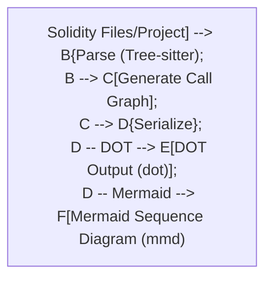

# Solidity to Call Graph (sol2cg)

`sol2cg` is a command-line tool that analyzes Solidity source code files or projects and generates visual representations of their internal call structures. It can produce:

1.  **Call Graphs:** In the standard DOT format, suitable for visualization with Graphviz.
2.  **Sequence Diagrams:** In MermaidJS syntax, illustrating the interaction flow between contracts and functions based on public/external entry points.

## Purpose

The primary goal of `sol2cg` is to help developers understand the control flow within Solidity contracts and across multiple contracts in a project. By visualizing function calls and returns, it aids in:

*   Debugging complex interactions.
*   Auditing code for potential issues like reentrancy or unexpected call patterns.
*   Documenting the architecture of a smart contract system.
*   Onboarding new developers to an existing codebase.

## Features

*   **Tree-sitter Powered:** Leverages the robust `tree-sitter` parsing library and its query language for accurate and efficient analysis of Solidity code structure.
*   **Strongly-Typed Approach:** Operates on a structured representation of the code (Abstract Syntax Tree and derived Call Graph), ensuring more reliable analysis compared to simple text-based methods.
*   **Multiple Output Formats:** Supports both DOT (for detailed graph visualization) and MermaidJS (for clear sequence diagrams).
*   **Handles Files and Directories:** Can process individual `.sol` files or entire directories containing Solidity code.
*   **Docker Support:** Provides a `Dockerfile` for easy containerization and execution in isolated environments.

## Workflow

The tool follows a clear pipeline:

1.  **Input:** Takes one or more Solidity `.sol` files or directories as input.
2.  **Parsing:** Parses the combined source code using `tree-sitter-solidity` to build an Abstract Syntax Tree (AST).
3.  **Call Graph Generation:** Analyzes the AST to identify function/modifier/constructor definitions and call sites, constructing an internal Call Graph representation. This graph includes nodes for definitions and edges for calls (with sequence numbers) and explicit returns (with return values where possible).
4.  **Serialization:** Converts the internal Call Graph into the desired output format:
    *   **DOT:** Serializes the graph directly into DOT language.
    *   **Mermaid:** Traverses the call graph starting from public/external entry points (simulating user interaction) to generate a contract-level sequence diagram in MermaidJS syntax.



## Usage

### Running the Binary

Assuming you have built the `sol2cg` binary (e.g., using `cargo build --release` in `crates/traverse-cli`), you can run it from your terminal.

**Command Syntax:**

```bash
sol2cg [OPTIONS] <INPUT_PATHS>...
```

**Arguments:**

*   `<INPUT_PATHS>...`: One or more paths to input Solidity files (`.sol`) or directories containing them.

**Options:**

*   `-o, --output-file <OUTPUT_FILE>`: Specifies the path to write the output. If omitted, output is written to standard output (stdout).
*   `-f, --format <FORMAT>`: Sets the output format.
    *   `dot` (Default): Generates a DOT graph file (often saved with `.gv` or `.dot` extension).
    *   `mermaid`: Generates a MermaidJS sequence diagram (often saved with `.mmd` extension).
*   `-h, --help`: Prints help information.
*   `-V, --version`: Prints version information.

**Examples:**

1.  **Generate DOT graph from a single file to stdout:**
    ```bash
    sol2cg path/to/your/Contract.sol
    ```

2.  **Generate Mermaid sequence diagram from multiple files into a specific output file:**
    ```bash
    sol2cg -f mermaid -o output/diagram.mmd src/ContractA.sol src/ContractB.sol
    ```

3.  **Generate DOT graph from all `.sol` files in a directory:**
    ```bash
    sol2cg -f dot -o output/full_graph.dot ./contracts/
    ```

### Running with Docker

A `Dockerfile` is provided to build a container image for `sol2cg`.

1.  **Build the Docker Image:**
    From the project root directory (containing the `Dockerfile`):
    ```bash
    docker build -t sol2cg .
    # Or specifically target the Dockerfile if run from elsewhere
    # docker build -t sol2cg -f path/to/Dockerfile .
    ```

2.  **Log in to GitHub Container Registry (if needed):**
    If the `sol2cg` image is private in `ghcr.io` or if you encounter permission issues when pulling, you first need to log in using a Personal Access Token (PAT) with `read:packages` scope:
    ```bash
    export CR_PAT=YOUR_GITHUB_PAT
    echo $CR_PAT | docker login ghcr.io -u YOUR_GITHUB_USERNAME --password-stdin
    ```

3.  **Run the Container:**
    You need to mount your Solidity source code directory into the container and potentially mount an output directory.

    **Command Syntax (Example):**
    ```bash
    docker run --rm \
      -v "$(pwd)/path/to/your/solidity/code:/app/input" \
      -v "$(pwd)/path/to/your/output:/app/output" \
      ghcr.io/gbrigandi/sol2cg [OPTIONS] /app/input/<INPUT_PATHS_INSIDE_CONTAINER>... -o /app/output/<OUTPUT_FILE_INSIDE_CONTAINER>
    ```
    *   `--rm`: Removes the container after execution.
    *   `-v "$(pwd)/path/to/your/solidity/code:/app/input"`: Mounts your local Solidity code directory to `/app/input` inside the container. Adjust the local path (`$(pwd)/path/to/your/solidity/code`) accordingly.
    *   `-v "$(pwd)/path/to/your/output:/app/output"`: Mounts your local output directory to `/app/output` inside the container. Adjust the local path (`$(pwd)/path/to/your/output`) accordingly.
    *   `ghcr.io/gbrigandi/sol2cg`: The name of the image you built.
    *   `[OPTIONS]`: The same options as the binary (`-f`, etc.).
    *   `/app/input/...`: Path(s) to your Solidity files/directories *inside the container*.
    *   `-o /app/output/...`: Path to the output file *inside the container*.

    **Example Docker Command:**
    Generate a Mermaid diagram from the `contracts` directory (mounted as `/app/input`) and save it to the `output` directory (mounted as `/app/output`):
    ```bash
    docker run --rm \
      -v "$(pwd)/contracts:/app/input" \
      -v "$(pwd)/output:/app/output" \
      ghcr.io/gbrigandi/sol2cg -f mermaid -o /app/output/sequence.mmd /app/input
    ```

## Building the Project

To build the `sol2cg` binary from source:

1.  **Clone the repository recursively:**
    The project uses submodules (e.g., for tree-sitter grammars). Ensure you clone recursively:
    ```bash
    git clone --recursive https://github.com/velvet-global/traverse.git
    cd traverse
    ```

2.  **Install Rust Toolchain:**
    Make sure you have Rust installed (version 1.83 or later is recommended). You can get it from [rustup.rs](https://rustup.rs/).

3.  **Build the release binary:**
    Navigate to the project root (the `traverse` directory cloned above) and run:
    ```bash
    cargo build --release
    ```
    The binary will be located at `target/release/sol2cg`.

## Output Formats

*   **DOT (.gv, .dot):** A text-based graph description language. Use tools like Graphviz (`dot` command-line tool) or online viewers (e.g., viz-js.com, Edotor) to render the `.dot` file into an image (SVG, PNG, etc.). This format shows all functions/modifiers/constructors and their direct call relationships.
*   **Mermaid (.mmd):** A Markdown-inspired syntax for generating diagrams. Paste the content of the `.mmd` file into tools or platforms that support Mermaid (e.g., GitHub Markdown, GitLab, Obsidian, dedicated Mermaid editors like mermaid.live). This format generates a sequence diagram focusing on the interactions between contracts initiated from public/external functions.

