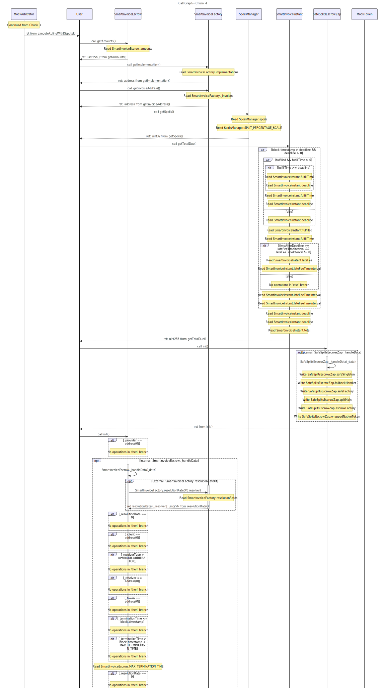

# Traverse

[](https://github.com/calltrace/traverse/actions/workflows/test.yml)
[](https://github.com/calltrace/traverse/releases/latest)

Static analysis tools for Solidity smart contracts. Generate call graphs, create tests, analyze storage patterns.


*17 contracts, 580 functions analyzed in ~500ms*

## Quick Start

```bash
brew tap calltrace/tap && brew install traverse
sol2cg contracts/*.sol -o graph.dot
dot -Tsvg graph.dot -o graph.svg
```

## Tools

- **sol2cg** - Generate call graphs (DOT/Mermaid)
- **sol2test** - Create Foundry test stubs
- **sol-storage-analyzer** - Map storage reads/writes
- **storage-trace** - Compare function storage access
- **sol2bnd** - Generate interface bindings

## IDE Integration

Integrate Traverse into your development workflow:
- **VS Code** - Full extension with UI
- **Neovim** - Zero-config plugin
- **Emacs/Helix/Sublime** - LSP support

## Documentation

Full documentation, installation guides, and examples at **[traverse.tools](https://traverse.tools)**

## Installation

### Homebrew
```bash
brew tap calltrace/tap && brew install traverse
```

### Docker
```bash
docker pull ghcr.io/calltrace/traverse:all
```

### Binaries
Download from [releases](https://github.com/calltrace/traverse/releases/latest)

### Build from Source
```bash
git clone --recursive https://github.com/calltrace/traverse.git
cd traverse
cargo build --release
```

## Examples

See [Smart Invoice analysis](examples/smart-invoice/) for real-world usage.

## License

MIT