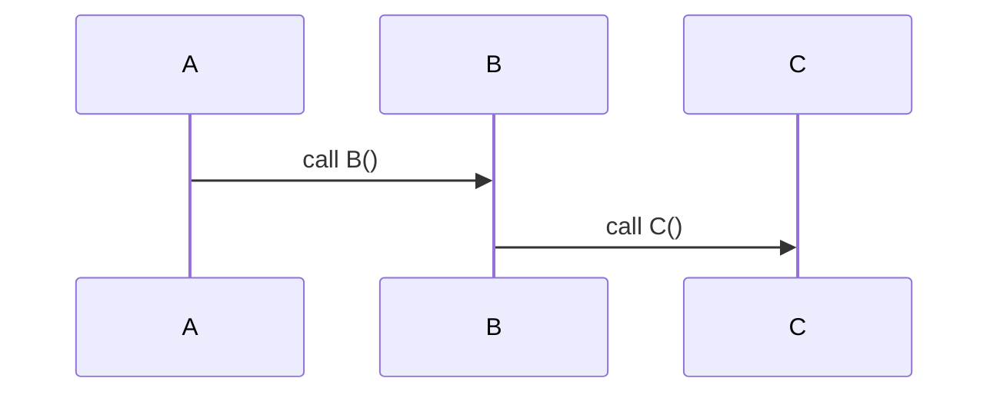

# Code Generation and Analysis Tool

> **Warning**: This is a work-in-progress (i.e. not functional yet) - project that is still under heavy development.

This tool provides a **typed AST-to-AST transformation framework** and **program analysis engine**. It leverages a **custom traversal DSL** and **Tree-sitter** grammars for parsing source code into Abstract Syntax Trees (ASTs) and a **Datalog-based backend** (e.g., DDLog) to evaluate transformations and queries efficiently.


The architecture separates into two key phases:
- **Generation Time**: Produces the runtime environment based on rules, grammars, and queries.
- **Runtime**: Executes the generated logic, incrementally processes input facts, and generates target artifacts like transformed ASTs or source files.

---

## Architecture Overview

### **1. Generation Time**
The generation phase involves creating the **runtime system** from user-specified **rules**, **grammars**, and **queries**.

- **Grammars (Tree-sitter)**: Define the input language’s syntax structure and parse input source files into ASTs.
- **Traversal Rules (custom DSL)**: Provide user-defined rules for AST traversal, transformations, or analysis.
- **Runtime Producer**:
  - Combines **grammars** and **rules** into input relations and logic.
  - Generates the **Datalog-based backend** (e.g., DDLog) to handle transformations and queries.
  - Produces a runtime environment ready for incremental execution.
- **Datalog Backend (DDLog)**:
  - Handles **queries**, **predicates**, and **transformations**.
  - Processes AST-to-AST transformations using Datalog rules.

### **2. Runtime**
The runtime phase executes the generated backend:
- **Input Source Files**: Feed facts (ASTs) into the runtime as input relations.
- **AST-to-AST Transformations**: 
  - Input ASTs are incrementally transformed into **target ASTs**.
  - Target ASTs are output as source files or other artifacts.
- **Incremental Generation**:
  - Handles changes to input source files efficiently.
  - Updates only the affected parts of the output source files or target ASTs.

---

## Features

### **Code Generation**
- Transform input ASTs into **typed output ASTs** and **source files**.
- Use **Tree-sitter grammars** to parse input languages and validate transformations.
- Incremental generation: Only reprocesses affected parts of the ASTs.

### **Program Analysis**
- Query and analyze ASTs using **Datalog rules** and **predicates**:
  - **Pattern Matching**: Identify specific AST structures or code patterns.
  - **Dataflow Analysis**: Track variable usage and propagation.
  - **Dead Code Detection**: Detect unused or unreachable code.
  - **Fixed-point Computations**: Perform recursive and iterative analyses efficiently.
- Leverages DDLog for efficient incremental updates and evaluation.

### **Separation of Concerns**
- **Generation Time**:
  - Builds the runtime environment using traversal rules, grammars, and queries.
  - Generates Datalog logic for transformations and predicates.
- **Runtime**:
  - Executes transformations and queries on input ASTs.
  - Incrementally generates target source files or artifacts.

### **Integration**
- Exposes AST-to-AST transformations as an **API** for third-party tools:
  - Integrate into editors or IDEs for real-time program analysis and transformations.
  - Use in CI/CD pipelines for automated refactoring or analysis.

---


## Installation

### Prerequisites
1. **Rust**: Install via [rustup](https://rustup.rs/).
2. **Datalog Backend**: The default implementation uses [DDLog](https://github.com/vmware/differential-datalog).

### Clone the Repository
```bash
git clone https://github.com/velvet-global/traverse --recursive
```
```bash
cd traverse
```

### Build the Project
```bash
cargo build --release
```

---

## Use Case: Converting Solidity Contracts to Mermaid Sequence Diagrams

A concrete application of this tool is transforming **Solidity smart contracts** (written for Ethereum) into **Mermaid sequence diagrams** to visualize the flow of function calls.

### Steps

1. **Define Grammar**:
   - Use a **Tree-sitter grammar for Solidity** to parse smart contracts into ASTs.

2. **Capture Source Nodes with the custom DSL**:
   - Use **capture expressions** to capture relevant AST nodes (function definitions and function calls) and emit **Mermaid AST nodes** while handling **parent-child relationships**.


   **Function Definitions**:
   ```scheme
   ; Match function definitions and emit Mermaid 'participant' nodes
   (function_definition
       name: (identifier) @function.def
       (#emit "participant" @function.def))

   ; Match function calls, emit Mermaid 'message' nodes, and handle relationships
   (function_call_expression
       function: (identifier) @function.call
       (#emit "message"
           (parent @function.def) ; Calling function (parent)
           "->>"
           (child @function.call) ; Function being invoked (child)
       ))
   ```

3. **Generate and Execute the Datalog Backend**:
   - Use the **Runtime Producer** to generate the backend for the specification. 
   - Execute the generated generator to process Solidity contracts and produce Mermaid diagrams.

   Example Command:
   ```bash
   solidity-to-mermaid -i test-contract.sol -o sequence-diagram-1.mermaid
   ```

   - `-i`: Path to the input Solidity contract.
   - `-o`: Path to the output Mermaid diagram file.

4. **Visualization**:
   - Render the Mermaid diagram syntax using any Mermaid-compatible tool.

---

### Example Mermaid Output

If the Solidity contract has the following structure:

```solidity
function A() {
    B();
}

function B() {
    C();
}

function C() {}
```

The tool generates the following Mermaid diagram:



---

### Workflow Summary

This approach abstracts the implementation details (Datalog backend) and focuses on delivering a user-friendly tool that takes Solidity smart contracts as input and outputs accurate Mermaid sequence diagrams.


## TODO

- [ ] Complete core and DSL.
- [ ] Implement Solidity to Mermaid as the first use case.
- [ ] Add incremental updates for AST processing.
- [ ] Support custom traversal rules and predicates using DSL.
- [ ] Expose runtime APIs for third-party integration.
- [ ] Enhance program analysis capabilities:
  - Dead code detection.
  - Dataflow and control flow analysis.
- [ ] Support additional Datalog backends (e.g., Soufflé).
- [ ] Automate testing for grammar validation and transformations.

---

