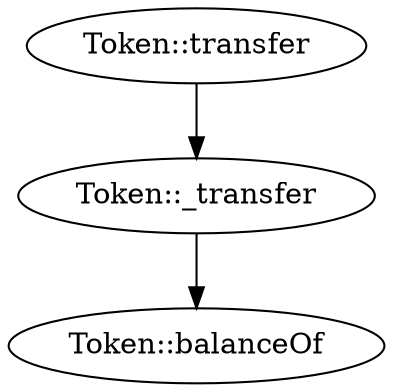
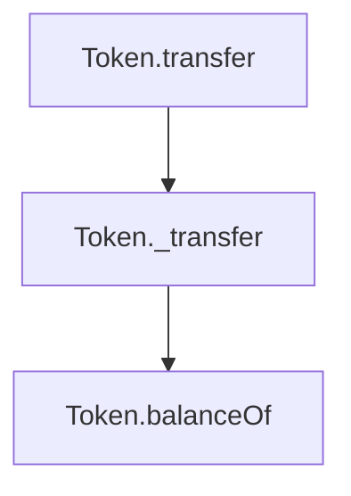

# traverse-graph

Call graph analysis and visualization for Solidity smart contracts.

## Overview

This crate provides comprehensive call graph generation and analysis capabilities for Solidity contracts. It identifies function relationships, external calls, and control flow patterns to help developers understand complex contract interactions.

## Features

- **Complete Call Graph Generation**: Maps all function calls within and between contracts
- **Cross-Contract Analysis**: Tracks external calls and interface interactions
- **Multiple Output Formats**: DOT (Graphviz), Mermaid, JSON
- **Intelligent Edge Detection**: Identifies direct calls, delegate calls, and dynamic dispatches
- **Inheritance Resolution**: Handles complex inheritance hierarchies
- **Modifier Tracking**: Includes modifier applications in call analysis

## Usage

```rust
use traverse_graph::{CallGraphBuilder, OutputFormat};

fn main() -> Result<(), Box<dyn std::error::Error>> {
    let mut builder = CallGraphBuilder::new();
    
    // Add Solidity files
    builder.add_file("contracts/Token.sol")?;
    builder.add_file("contracts/Exchange.sol")?;
    
    // Build the call graph
    let graph = builder.build()?;
    
    // Export to different formats
    graph.to_dot("output/call_graph.dot")?;
    graph.to_mermaid("output/call_graph.mmd")?;
    
    Ok(())
}
```

## Command Line Tool

This crate powers the `sol2cg` command-line tool:

```bash
# Generate a call graph from Solidity files
sol2cg contracts/*.sol -o call_graph.dot

# Convert to PNG using Graphviz
dot -Tpng call_graph.dot -o call_graph.png
```

## Output Formats

### DOT (Graphviz)


### Mermaid


## Analysis Capabilities

- Function reachability analysis
- Circular dependency detection
- Entry point identification
- Gas cost estimation paths
- Security pattern recognition

## Part of Traverse

This crate is part of the [Traverse](https://github.com/calltrace/traverse) suite of tools for Solidity code analysis, visualization, and test generation.

## License

MIT OR Apache-2.0