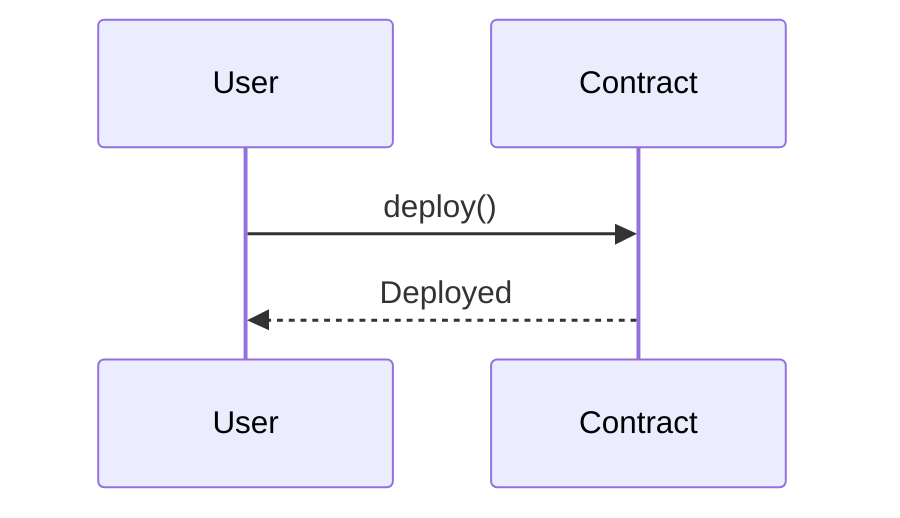

# traverse-mermaid

Mermaid diagram generation for visualizing Solidity smart contract interactions.

## Overview

This crate provides utilities to generate Mermaid diagrams from analyzed Solidity code, enabling visual representation of contract relationships, call graphs, and sequence diagrams. Mermaid diagrams can be rendered in documentation, GitHub, or any Mermaid-compatible viewer.

## Features

- **Sequence Diagrams**: Visualize contract interaction flows
- **Call Graphs**: Map function call relationships
- **Class Diagrams**: Show contract inheritance and structure
- **State Diagrams**: Represent contract state machines
- Clean, readable Mermaid syntax output

## Usage

```rust
use traverse_mermaid::{SequenceDiagram, Statement};

fn main() {
    let mut diagram = SequenceDiagram::new();
    
    // Add participants
    diagram.add_participant("User");
    diagram.add_participant("Contract");
    
    // Add interactions
    diagram.add_message("User", "Contract", "deploy()");
    diagram.add_message("Contract", "User", "Deployed");
    
    // Generate Mermaid code
    let mermaid_code = diagram.to_mermaid();
    println!("{}", mermaid_code);
}
```

## Output Example



## Supported Diagram Types

- Sequence diagrams with alt/opt/loop blocks
- Directed graphs for call analysis
- Flowcharts for control flow
- Class diagrams for contract structure

## Part of Traverse

This crate is part of the [Traverse](https://github.com/calltrace/traverse) suite of tools for Solidity code analysis, visualization, and test generation.

## License

MIT OR Apache-2.0