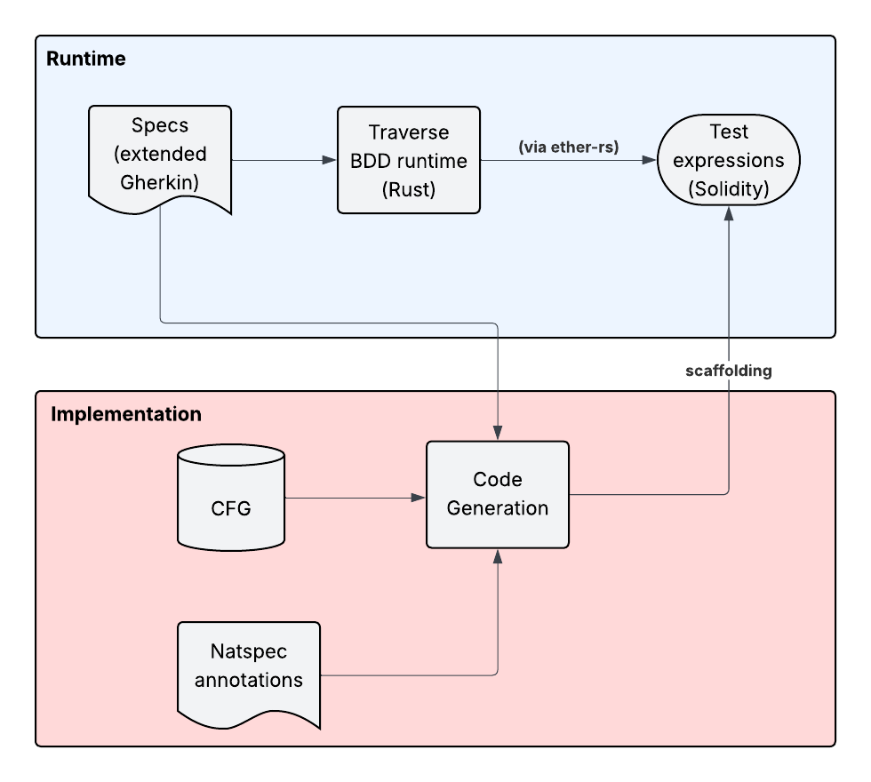

# A Custom BDD Framework for Solidity: Bridging the Gap with Extended Gherkin

## Introduction: The Need for a Specialized Solidity BDD Solution

Behavior-Driven Development (BDD) offers a powerful paradigm for defining and testing system behavior through natural language specifications. However, when applying BDD principles to Solidity smart contracts, existing generic BDD frameworks often reveal significant "whitespace" – crucial gaps in functionality, integration, and expressiveness. Smart contracts operate within a unique ecosystem characterized by complex state transitions, intricate control flows, and a rich tapestry of on-chain and development-time metadata (like Natspec).

Standard BDD tools, while versatile for general software, are not inherently designed to navigate these specific complexities. This often leads to cumbersome workarounds, the necessity for extensive "glue code" to bridge the BDD layer with Solidity testing primitives, and a potential disconnect between the high-level specification and the low-level contract logic. This gap motivates the development of a specialized BDD solution, tailored from the ground up for the nuances of Solidity.

## Proposed Approach: Extending Gherkin for Deep Solidity Integration

A custom BDD solution for Solidity is proposed, architected around an extended Gherkin grammar and a dedicated BDD runtime. This approach is designed to directly address the limitations of existing tools by offering the following advantages:

*   **Richer Semantic Constructs for Complex Analysis:** The extended grammar surpasses standard Gherkin's tabular data capabilities by introducing constructs for defining and verifying scenarios with graph-like structures (e.g., Control Flow Graphs - CFGs). This facilitates more sophisticated behavioral tests that reason about execution paths, complex state interactions, and contract invariants directly within the BDD specification.

*   **Elimination of Brittle Glue Code:** The custom runtime directly interprets the extended Gherkin and interacts with the Solidity contract environment (AST, bytecode, testing frameworks). This minimizes or eliminates the need for manual "glue code" – a common friction point that bridges Gherkin steps with Solidity testing primitives (like Foundry's `forge std` or Hardhat's Ethers.js interactions) – leading to simpler test creation and enhanced maintainability.

*   **Seamless Natspec Integration for Enriched Context:** Solidity's NatSpec comments are seamlessly parsed and leveraged as additional context during test execution or specification analysis. This allows BDD scenarios to be implicitly enriched by this metadata without cluttering Gherkin feature files, keeping specifications clean while making tests more informed.

*   **Full Control Over Gherkin Semantics and Extensions:** Developing a custom Gherkin parser and runtime provides fine-grained control over its semantics. This enables the introduction of custom keywords, step definitions, and domain-specific language (DSL) elements tailored to smart contract interactions, such as asserting event emissions, verifying state changes, or modeling transaction sequences, making specifications more expressive.

*   **Designed for LLM Compatibility and Enrichment:** The structured nature of the extended Gherkin, with direct access to Solidity ASTs, Natspec, and CFGs, creates a rich input format ideal for Large Language Models (LLMs). This architecture facilitates LLM-assisted test generation, scenario enrichment, automated explanations for test failures, and suggestions for new test cases.

## Limitations of Existing BDD Frameworks for Solidity

While frameworks like `cucumber-rs` (for Rust-based testing) and other BDD solutions adapted for Solidity (often built on JavaScript test runners like Mocha or Jest) provide general BDD capabilities, they inherently struggle with the specific demands of smart contract testing. Their generic design or limited integration depth leads to several shortcomings:

*   **Graph-based Constructs & Complex State:** Standard Gherkin implementations (e.g., in `cucumber-rs` or JavaScript BDD libraries) primarily support linear steps and tabular data. They lack native mechanisms for graph structures (like CFGs) or deep contract state analysis without extensive custom glue code, making it hard to specify behaviors for complex execution paths or state dependencies.

*   **Glue Code Overhead & Fragility:** Frameworks like `cucumber-rs` require significant "glue code" (Rust, JavaScript) to map Gherkin to Solidity test logic. This involves complex setup for deployment, invocation, and assertion, adding burden and creating a fragile indirection layer that obscures BDD intent and breaks easily.

*   **Natspec Integration & Solidity-Awareness:** Existing frameworks are generally agnostic to Solidity's Natspec. Leveraging this rich metadata requires custom parsing and more glue code, as they lack native "Solidity-awareness."

*   **Semantic Control and Extensibility for Solidity:** While custom steps are possible, extending Gherkin's core grammar or deeply tailoring semantics for Solidity concepts (e.g., specific transaction details, event logs, revert reasons) is often infeasible or overly complex, limiting expressiveness for nuanced smart contract behaviors.

*   **LLM Enrichment Potential:** The abstraction, reliance on glue code, and lack of direct access to Solidity artifacts in generic BDD frameworks provide a less direct and semantically poor input for LLMs. A custom, Solidity-aware solution offers a richer foundation for LLM-assisted BDD.

## Technical Architecture: System Flows and Component Interactions

This architecture represents a specification-driven development system that bridges formal behavioral requirements with automated code generation. The system consists of two distinct architectural layers: a Runtime layer that handles specification processing and test generation, and an Implementation layer responsible for code synthesis. The Runtime layer processes extended Gherkin specifications through a custom Rust-based BDD runtime to produce Solidity test expressions via ether-rs integration. The Implementation layer combines Control Flow Graph analysis with Natspec documentation annotations to drive code generation, with scaffolding provided by the test expressions from the Runtime layer creating a bridge between specification verification and implementation synthesis.

The system's operation initiates within the Runtime Layer, where extended Gherkin specifications, serving as formal behavioral requirements, are ingested. A custom Gherkin parser first processes these specifications, transforming the human-readable syntax into a structured, machine-interpretable format. This parsed representation is then fed into the core of the Runtime Layer: a Rust-based BDD runtime. This runtime engine interprets the semantic meaning of the Gherkin steps and orchestrates the logic required to verify the specified behaviors. A key data transformation occurs here as abstract behavioral definitions are mapped to concrete test actions. To materialize these actions into verifiable artifacts, the BDD runtime collaborates with a Solidity Test Expression Generator. This component, leveraging the `ether-rs` library, translates the test logic into Solidity test expressions, effectively producing executable test cases that embody the initial Gherkin specifications. These test expressions form the primary output of the Runtime Layer.

Within the implementation layer, the code generation process is driven by a confluence of analytical inputs. A Control Flow Graph (CFG) Analyzer processes existing contract structures or high-level designs to map out potential execution paths and logical dependencies. Concurrently, a Natspec Parser extracts rich semantic information and developer intent embedded within Solidity documentation annotations. The Code Generation Engine is the central processing unit of the Implementation Layer. It synthesizes these diverse inputs—the structural insights from CFG analysis, the semantic context from Natspec, and the behavioral scaffolding provided by the test expressions from the Runtime Layer—to generate functional Solidity smart contract code. This generated code is the ultimate output of the Implementation Layer, designed to satisfy the behaviors defined and verified by the Runtime Layer. 