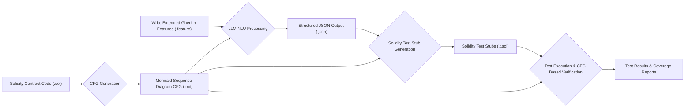
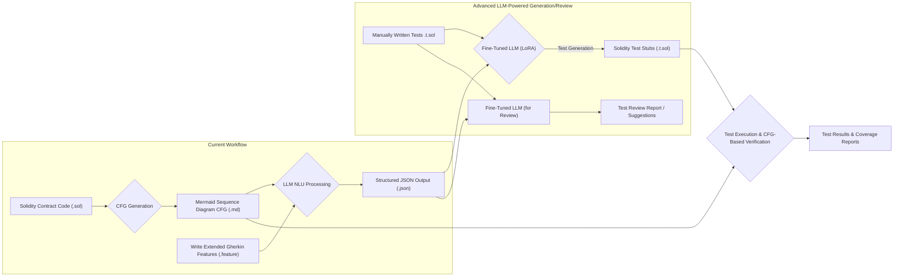

# Automated Solidity Test Generation from CFG and Extended Gherkin Features

This document outlines a proposed solution for automatically generating Solidity tests by leveraging Control Flow Graphs (CFGs), an extended version of Gherkin for feature descriptions, and a Large Language Model (LLM) for Natural Language Understanding (NLU).

## Overview

Testing smart contracts, particularly complex Solidity projects, can be time-consuming and error-prone. This solution aims to streamline and enhance the testing process by:

(Note: All examples and file names used in this document, such as `SimpleERC20.sol`, `MyTokenTransfer.feature`, etc., are for illustrative purposes to demonstrate the concepts.)

1.  **Visualizing Contract Logic**: Using CFGs, specifically in a Mermaid sequence diagram format, to represent the contract's execution paths.
2.  **Natural Language Test Specification**: Employing an extended Gherkin syntax that allows testers to write feature descriptions in a near-natural language, while also incorporating references to CFG elements and Solidity-specific semantics.
3.  **Automated NLU and Structuring**: Utilizing an LLM to parse these Gherkin features and convert them into a structured JSON format, suitable for automated processing.
4.  **Test Stub Generation**: Automatically generating Solidity test stubs (e.g., for Foundry) from the structured JSON.
5.  **CFG-Aware Test Execution**: Running the generated test stubs, with the CFG serving as a reference for verifying invariants, path coverage, and other critical aspects of contract behavior.

## Core Components

*   **Solidity Contract (`.sol`)**: The smart contract to be tested. (e.g., [`SimpleERC20.sol`](./SimpleERC20.sol) in this project).
*   **Control Flow Graph (CFG - `.md`)**: A Mermaid sequence diagram representing the contract's functions and their interactions. (e.g., [`SimpleERC20.md`](./SimpleERC20.md)).
*   **Extended Gherkin Features (`.feature`)**: Test scenarios written in Gherkin, with extensions to reference CFG nodes, specify Solidity actions, and define expected outcomes. (e.g., [`MyTokenTransfer.feature`](./MyTokenTransfer.feature)).
*   **Gherkin JSON Schema ([`gherkin-extended-schema.json`](./gherkin-extended-schema.json))**: Defines the expected structured JSON output after LLM processing of Gherkin features.
*   **Structured JSON Output ([`example-usage.json`](./example-usage.json))**: The LLM's output, representing the Gherkin features in a machine-readable format.
*   **Generated Solidity Tests (`.t.sol`)**: Test stubs automatically generated from the structured JSON. (e.g., [`MyTokenTransfer.t.sol`](./MyTokenTransfer.t.sol)).

## Workflow

The proposed workflow is as follows:

1.  **CFG Generation**:
    *   The Control Flow Graph of the Solidity smart contract is generated.
    *   This CFG is represented as a Mermaid sequence diagram (e.g., `SimpleERC20.md`).
2.  **Gherkin Feature Authoring**:
    *   Testers write feature files using an extended Gherkin syntax.
    *   These features describe test scenarios in a near-natural language, incorporating:
        *   **Flow semantics**: Explicitly linking steps or scenarios to CFG nodes or paths.
        *   **Solidity-specific semantics**: Defining contract interactions, expected events, state changes, and revert conditions.
        *   **Testing semantics**: Specifying preconditions, user roles (actors), and points at which to verify contract invariants.
3.  **LLM-Powered NLU**:
    *   The Gherkin feature descriptions are submitted to a target Large Language Model (LLM).
    *   The LLM performs Natural Language Understanding and transforms the Gherkin text into a structured JSON file. This JSON file adheres to a predefined schema (`gherkin-extended-schema.json`) and captures all rules, steps, and CFG/Solidity semantics (see `example-usage.json`).
4.  **Solidity Test Stub Generation**:
    *   The structured JSON output from the LLM is fed into a code generation process.
    *   This process generates Solidity test stubs (e.g., for Foundry framework, like `MyTokenTransfer.t.sol`).
5.  **Test Execution and Verification**:
    *   The generated test stubs are compiled and executed against the smart contract.
    *   During execution, the CFG is used as an input or reference to:
        *   Verify that specified execution paths are covered.
        *   Check contract invariants at defined checkpoints.
        *   Assert state changes and event emissions as described in the Gherkin features.

### Workflow Diagram



This approach aims to create a robust and efficient framework for testing Solidity smart contracts, bridging the gap between human-readable specifications and executable tests.

## End-to-End Example Scenario

Let's illustrate the proposed workflow using the example files provided:

*   **Contract**: [`SimpleERC20.sol`](./SimpleERC20.sol)
*   **CFG**: [`SimpleERC20.md`](./SimpleERC20.md)
*   **Gherkin Feature**: [`MyTokenTransfer.feature`](./MyTokenTransfer.feature)
*   **Structured JSON**: [`example-usage.json`](./example-usage.json)
*   **Generated Test**: [`MyTokenTransfer.t.sol`](./MyTokenTransfer.t.sol) (Note: The provided [`MyTokenTransfer.t.sol`](./MyTokenTransfer.t.sol) currently mirrors the Gherkin file content; in a real scenario, it would be actual Solidity test code).

**Scenario**: Testing the token transfer functionality of the [`SimpleERC20.sol`](./SimpleERC20.sol) contract.

1.  **CFG Generation (Input: [`SimpleERC20.sol`](./SimpleERC20.sol))**:
    *   The [`SimpleERC20.sol`](./SimpleERC20.sol) contract is analyzed, and its Control Flow Graph is generated.
    *   This CFG is represented as a Mermaid sequence diagram in [`SimpleERC20.md`](./SimpleERC20.md). This diagram visually maps out functions like `transfer`, `_transfer`, `approve`, etc., and their interactions. For instance, it would show that `transfer` calls the internal `_transfer` function.

2.  **Gherkin Feature Authoring (Input: [`SimpleERC20.md`](./SimpleERC20.md) as reference)**:
    *   A tester, referencing the [`SimpleERC20.md`](./SimpleERC20.md) CFG, writes test scenarios in [`MyTokenTransfer.feature`](./MyTokenTransfer.feature).
    *   Example snippet from [`MyTokenTransfer.feature`](./MyTokenTransfer.feature):
        ```gherkin
        Scenario: Basic token transfer between accounts
          When Alice transfers 100 tokens to Bob
          Then Bob's balance should be 100 tokens
          And Alice's balance should be 900 tokens
        ```
    *   The Gherkin steps implicitly or explicitly link to CFG nodes (e.g., "Alice transfers 100 tokens to Bob" relates to the `transfer` function in the CFG).

3.  **LLM-Powered NLU (Input: [`MyTokenTransfer.feature`](./MyTokenTransfer.feature), [`SimpleERC20.md`](./SimpleERC20.md))**:
    *   The [`MyTokenTransfer.feature`](./MyTokenTransfer.feature) file is processed by the LLM. The LLM uses its understanding of the Gherkin syntax, the extended semantics, and potentially the CFG context from [`SimpleERC20.md`](./SimpleERC20.md).
    *   The LLM outputs a structured JSON file, [`example-usage.json`](./example-usage.json), which conforms to [`gherkin-extended-schema.json`](./gherkin-extended-schema.json).
    *   Corresponding snippet from [`example-usage.json`](./example-usage.json) for the "When" step:
        ```json
        {
          "keyword": "When ",
          "name": "Alice transfers 100 tokens to Bob",
          "solidityAction": {
            "type": "call",
            "contract": "token", // Assumes 'token' is the instance name for MyToken
            "function": "transfer",
            "args": ["bob", "100"], // 'bob' would be resolved to an address
            "from": "alice",      // 'alice' would be resolved to an address
            "cfgNodeId": "MyToken.transfer",
            "expectedPath": ["MyToken.transfer", "MyToken._transfer"]
          }
        }
        ```

4.  **Solidity Test Stub Generation (Input: [`example-usage.json`](./example-usage.json))**:
    *   The [`example-usage.json`](./example-usage.json) is fed into a code generator.
    *   This generator creates Solidity test stubs for a framework like Foundry. The (conceptual) [`MyTokenTransfer.t.sol`](./MyTokenTransfer.t.sol) would contain test functions based on the scenarios.
    *   A generated test function for the "Basic token transfer" scenario might look conceptually like this (actual generation would be more complex):
        ```solidity
        // Hypothetical generated test in MyTokenTransfer.t.sol
        function test_BasicTokenTransfer() public {
            // Setup from 'Background' steps (e.g., deploy MyToken, set Alice's/Bob's initial balance)
            vm.prank(aliceAddress);
            myTokenInstance.transfer(bobAddress, 100 * 10**18);

            assertEq(myTokenInstance.balanceOf(bobAddress), 100 * 10**18, "Bob's balance should be 100");
            assertEq(myTokenInstance.balanceOf(aliceAddress), 900 * 10**18, "Alice's balance should be 900");
            // Potentially check total supply invariant if specified
        }
        ```

5.  **Test Execution and Verification (Input: [`MyTokenTransfer.t.sol`](./MyTokenTransfer.t.sol), [`SimpleERC20.md`](./SimpleERC20.md))**:
    *   The generated [`MyTokenTransfer.t.sol`](./MyTokenTransfer.t.sol) is compiled and executed using Foundry.
    *   During or after execution, the results are verified. The CFG ([`SimpleERC20.md`](./SimpleERC20.md)) can be used to:
        *   Confirm that the execution path taken during the `transfer` call (e.g., `MyToken.transfer` -> `MyToken._transfer`) matches the `expectedPath` from the JSON.
        *   Check any specified contract invariants (e.g., `token-supply-constant` from [`example-usage.json`](./example-usage.json)) at relevant points (e.g., after the `_transfer` internal call).

This end-to-end flow demonstrates how the different components work together to move from a high-level Gherkin specification, informed by a contract's CFG, to executable Solidity tests.

## Advanced Approach: LLM-Powered Test Generation & Review via Fine-Tuning

Beyond the workflow described above, a more sophisticated and potentially powerful approach involves leveraging a fine-tuned Large Language Model (LLM) for the direct generation and review of Solidity test code.

### Concept

Instead of a rule-based or template-based system for generating test stubs from the structured JSON, this advanced approach would involve:

1.  **Specialized LLM Training**: Fine-tuning a base LLM (e.g., using techniques like Low-Rank Adaptation - LoRA) specifically on the task of converting the structured JSON (as defined by [`gherkin-extended-schema.json`](./gherkin-extended-schema.json) and exemplified in [`example-usage.json`](./example-usage.json)) into high-quality, executable Solidity test code for frameworks like Foundry or Hardhat.
2.  **Input**: The fine-tuned LLM would take the structured JSON (which encapsulates Gherkin features, CFG details, Solidity semantics, and testing requirements) as its primary input.
3.  **Output**:
    *   **Test Generation**: The LLM would directly generate complete and contextually relevant Solidity test functions or even entire test contracts.
    *   **Test Review**: The LLM could also be used to review existing, manually written Solidity tests by comparing them against a provided JSON specification. It could identify discrepancies, suggest improvements, or flag areas where the test code doesn't fully cover the specified features or CFG paths.

### Workflow Extension with Fine-Tuned LLM



### Challenges and Considerations

*   **Dataset Curation**: Requires a significant and high-quality dataset of (JSON specification, Solidity test code) pairs for effective fine-tuning.
*   **Model Training Complexity**: Fine-tuning LLMs, even with techniques like LoRA, requires expertise and computational resources.
*   **Ensuring Correctness**: Validating that the LLM-generated code is not only syntactically correct but also logically sound and secure is crucial.
*   **Determinism and Controllability**: Achieving consistent and predictable output from the LLM for specific inputs might require further research and refinement.

### Potential Benefits

*   **More Idiomatic and Complex Tests**: A fine-tuned LLM could potentially generate more natural, idiomatic, and complex test scenarios than template-based systems.
*   **Adaptability**: Easier to adapt to new Solidity versions, testing best practices, or changes in the JSON schema by retraining or further fine-tuning the model.
*   **Automated Test Review**: Offers a path towards automating parts of the code review process for tests, ensuring they align with specifications.

## Example Prompt

The following section provides an example of the type of prompt that will be programmatically generated by our system. This structured prompt is designed to be sent to an LLM host (e.g., OpenAI, Anthropic, or a locally hosted model). Its purpose is to guide the LLM in accurately converting Gherkin feature files, along with their associated Control Flow Graphs (CFGs) and contract metadata, into the desired structured JSON output. This JSON output then serves as the direct input for the automated generation of Solidity test code.

You are a specialized assistant for blockchain developers. Your task is to convert Gherkin BDD specifications into a structured JSON format that will be used to generate Solidity test code. You must adhere strictly to the schema provided below.

### Input

I will provide:
1. A Gherkin feature file with scenarios for testing Solidity contracts
2. A control flow graph (CFG) representation or description of the contract
3. Contract metadata such as function signatures and state variables

### Output Requirements

Generate a JSON document that strictly follows this schema structure:

```json
{
  "implementation": "solidity-bdd-test-gen",
  "features": [
    {
      "uri": "string",
      "id": "string",
      "keyword": "Feature",
      "name": "string",
      "description": "string",
      "solidityTestFile": "string",
      "testFramework": "string",
      "contractsUnderTest": ["string"],
      "elements": [
        // Array of scenarios and backgrounds
      ]
    }
  ],
  "controlFlowGraph": {
    "nodes": [
      // Array of CFG nodes
    ],
    "edges": [
      // Array of CFG edges
    ]
  },
  "contractMetadata": {
    "contracts": [
      // Array of contract definitions
    ]
  }
}
```

### Schema Adherence Rules

1. Each Gherkin step must be mapped to a `solidityAction` with one of these types:
   - `deploy`, `call`, `expectRevert`, `expectEmit`, `expectBalance`, `expectStorage`, 
   - `mockCall`, `prank`, `deal`, `warp`, `roll`, `snapshot`, `revertTo`, 
   - `assertInvariant`, `assertState`, `cfgTraversal`

2. Each Gherkin scenario should include references to the CFG nodes that will be traversed during testing

3. Every action in a test must have appropriate parameters:
   - Functions should include parameter values
   - Assertions should include expected values
   - State checks should reference contract variables

4. Invariants should be defined and referenced in appropriate test steps

5. For any revert/failure case, include the expected error message

### Step-by-Step Conversion Process

For each Gherkin feature:
1. Extract metadata (name, description) into the feature object
2. For each scenario:
   - Map Given steps to setup actions
   - Map When steps to test actions
   - Map Then steps to assertions
   - Identify relevant CFG nodes for each step
   - Include specific assertions for each verification
3. Ensure all referenced functions match the contract's actual functions
4. Define invariants that should be checked after operations
5. Specify expected CFG path coverage

### Example Structure for a Solidity Action

```json
"solidityAction": {
  "type": "call",
  "contract": "TokenContract",
  "function": "transfer",
  "args": ["recipient", "amount"],
  "from": "sender",
  "cfgNodeId": "TokenContract.transfer",
  "expectedPath": ["TokenContract.transfer", "TokenContract._transfer"],
  "stateAssertions": [
    {
      "contract": "TokenContract",
      "variable": "balanceOf(recipient)",
      "expected": "amount",
      "message": "Recipient should receive tokens"
    }
  ]
}
```

### Important Context Rules

- Interpret "Given" steps as state setup or preconditions
- Interpret "When" steps as actions that change state
- Interpret "Then" steps as assertions checking postconditions
- Parse tables in Gherkin as parameters for functions
- Convert natural language values into appropriate Solidity literals
- Map actor names (Alice, Bob) to actor addresses in the test

Now, based on these requirements, convert the following Gherkin specification into the structured JSON format:

[GHERKIN_SPECIFICATION]

Contract CFG and metadata:

[CONTRACT_METADATA]


